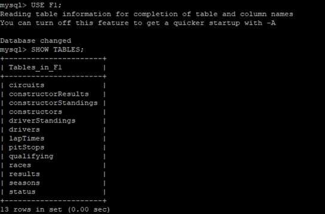

# LSMotor
LSMotor is a practical database exercise that consists in adapting an OLTP database containing Formula 1 information into an OLAP and performing a series of tests and queries to check that it works correctly.

The steps to follow are:
- First we have to access a remote server provided by the university and locate the OLTP database.
- The next step is to import this database into a local OLTP using a Java JDBC program.
- After analysing the OLTP, we propose a relational model of an OLAP that aims to be able to make modifications to the database more efficiently.
- We create a physical model of the OLAP and import the information from the local OLTP using stored procedures, events and triggers.
- We perform several queries to check that the data has been imported correctly and that our model works.
- Finally, we make a performance comparison between OLTP and OLAP to verify that OLAP is indeed more efficient for the purpose of modifying the database.

## Remote OLTP

## Local OLAP

## SQL procedures
All queries, events, triggers and procedures can be found in the documentation Memoria.pdf

## Concepts developed in this project:
- Learn the concepts of OLTP and OLAP databases as well as a practical benchmarking exercise to compare their performance and uses.
- Develop a Java JDBC program to import data from a remote database.
- Provide documentation that describes in detail all the processes followed in the execution of this exercise, as well as the justification of all the steps and decisions taken.

